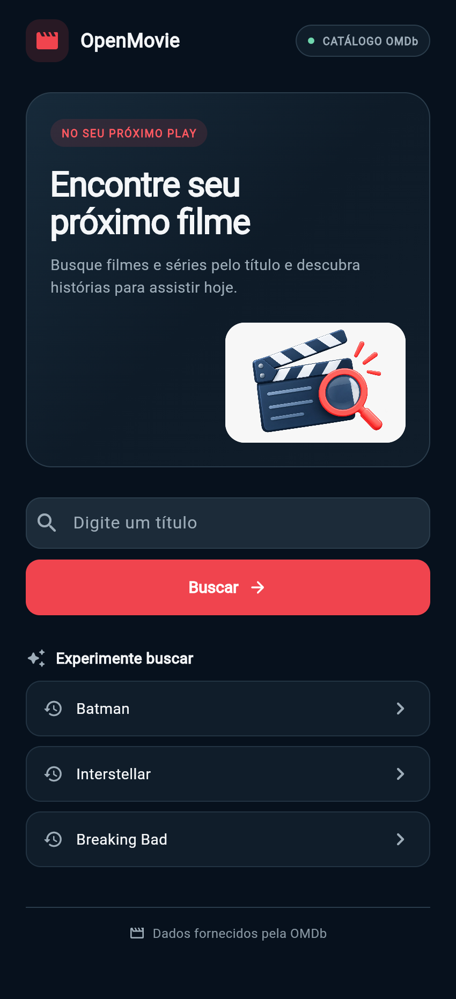
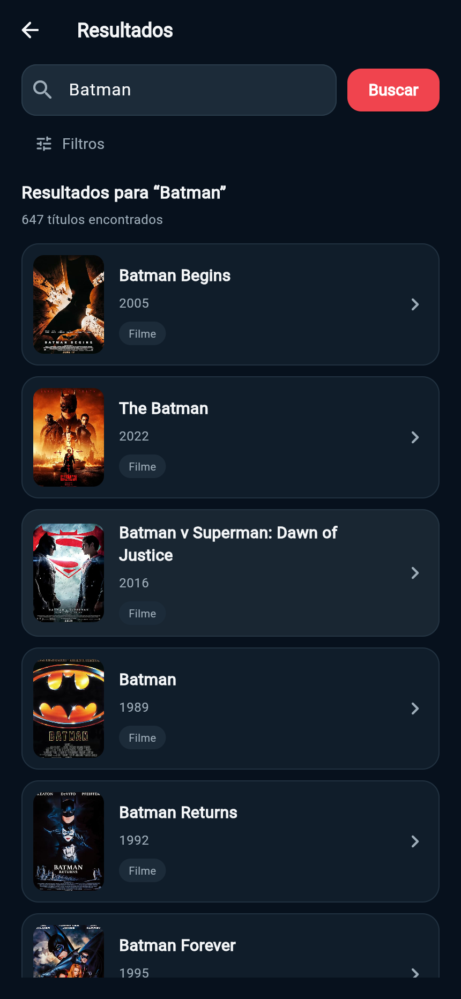
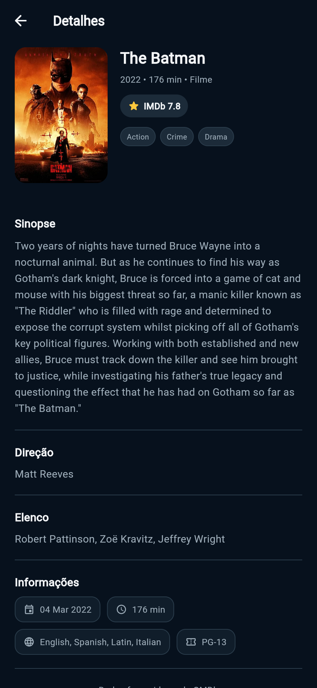

# OpenMovie

Aplicativo Flutter para pesquisar filmes e séries no catálogo da OMDb. A interface segue a referência visual enviada para a atividade: tema escuro, destaque coral e fluxo de início, resultados e detalhes.

A documentação técnica v3 descreve o MVP inicial de consulta fixa por Batman. A versão atual evoluiu para busca geral por título, mantendo Batman como sugestão inicial na Home; ela não faz a consulta fixa automaticamente ao abrir.

## O que já funciona

- Pesquisa de filmes e séries pelo título.
- Resultados com pôster, ano e tipo de produção.
- Paginação com botão “Carregar mais”.
- Filtros opcionais por tipo de produção e ano.
- Tela de detalhes consultada pelo identificador IMDb, com sinopse, notas, gêneros, direção, roteiro, elenco, prêmios e demais campos disponíveis.
- Consulta de temporadas e lista de episódios para séries, dentro da própria tela de detalhes; selecionar um episódio abre sua ficha no mesmo fluxo.
- Histórico local das cinco buscas mais recentes, com opção para limpar.
- Estados de carregamento, busca vazia, falha de rede, erro da API e tentativa novamente.
- Interface adaptada para telas estreitas e largas.
- Chave da OMDb fornecida em tempo de execução, sem valor gravado no código-fonte.
- Testes automatizados do serviço para busca e filtros, detalhes, temporadas/episódios, erros da API e chave ausente.

## Como executar

Requisitos: Flutter instalado, conexão com a internet e uma chave ativa da OMDb.

Na pasta do projeto, execute:

~~~powershell
flutter pub get
flutter run --dart-define=OMDB_API_KEY=SUA_CHAVE
flutter analyze
flutter test
~~~

Troque SUA_CHAVE por uma chave ativa. Não coloque a chave real em arquivos versionados, capturas de tela ou mensagens de commit. Como o app chama a OMDb diretamente, a chave incluída em uma compilação de cliente pode ser extraída; para publicação real, o ideal é fazer a chamada por um servidor.

## Como o app usa a OMDb

- Busca: https://www.omdbapi.com/?apikey=…&s=TITULO&page=1&type=movie&y=2022&r=json
- Detalhes: https://www.omdbapi.com/?apikey=…&i=ID_IMDB&plot=full&r=json
- Temporadas: https://www.omdbapi.com/?apikey=…&i=ID_IMDB&Season=1&r=json
- O serviço interpreta a resposta JSON e converte os dados para modelos Dart.
- A API recebe a chave em cada requisição. O app não inclui uma chave padrão.

## Organização do código

- lib/main.dart: inicialização e tema do aplicativo.
- lib/screens/home_screen.dart: apresentação, busca e histórico recente.
- lib/screens/results_screen.dart: busca, estados da tela, resultados e paginação.
- lib/screens/details_screen.dart: consulta e apresentação dos detalhes.
- lib/services/omdb_service.dart: requisições HTTP, decodificação e mensagens de erro.
- lib/services/search_history_store.dart: histórico local usando Shared Preferences.
- lib/models/movie.dart: modelos para resultados e detalhes.
- lib/widgets/: campo de busca e componente de pôster.
- lib/theme/app_theme.dart: cores e estilos compartilhados.
- docs/LISTA_DE_PENDENCIAS.md: situação da entrega e melhorias futuras.

## Capturas de tela

Capturas do app executando no navegador:

## Próximos passos fora da entrega atual

- Revisar acessibilidade e navegação por leitor de tela.
- Criar um backend intermediário antes de publicar o app; chaves incluídas em aplicativos cliente podem ser extraídas.
- Ampliar os testes de widget para navegação e estados visuais além dos testes de serviço já existentes.

## Documentos e capturas

- Documentacao_OpenMovie_Completa.pdf registra o escopo técnico inicial; a busca geral e os detalhes são a evolução atual do projeto.
- docs/LISTA_DE_PENDENCIAS.md registra o estado de implementação e a verificação manual restante.
- output/pdf/Pendencias_OpenMovie_Entrega.pdf compara o código com a documentação e separa sugestões futuras.
- As capturas das três telas ficam em screenshots/; a Home foi recapturada depois da inclusão da imagem enviada.

## Fonte de dados

Os dados de filmes e séries são fornecidos pela [OMDb API](https://www.omdbapi.com/).
